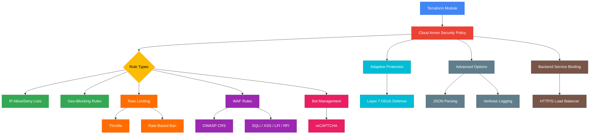

# terraform-gcp-cloud-armor

A production-ready Terraform module for managing Google Cloud Armor security policies with comprehensive rule management including IP allowlists/denylists, geo-blocking, rate limiting, WAF rules, bot management, and adaptive protection.

## Architecture



## Features

- **IP Access Control**: Allowlist and denylist rules with CIDR range support
- **Geo-Blocking**: Country-based access restrictions using region codes
- **Rate Limiting**: Configurable rate thresholds per IP, header, cookie, or path
- **Rate-Based Ban**: Automatic banning when request rates exceed thresholds
- **WAF Rules**: Pre-configured OWASP ModSecurity Core Rule Set with sensitivity tuning
- **Bot Management**: reCAPTCHA integration for automated challenge-response
- **Adaptive Protection**: ML-based Layer 7 DDoS defense
- **Backend Binding**: Automatic attachment to HTTP(S) Load Balancer backend services

## Usage

### Basic

```hcl
module "cloud_armor" {
  source = "path/to/terraform-gcp-cloud-armor"

  project_id          = "my-project"
  name                = "my-security-policy"
  default_rule_action = "allow"

  rules = [
    {
      action   = "deny(403)"
      priority = 1000
      description = "Block known bad IPs"
      match = {
        versioned_expr = "SRC_IPS_V1"
        config = {
          src_ip_ranges = ["192.0.2.0/24", "198.51.100.0/24"]
        }
      }
    }
  ]
}
```

## Requirements

| Name | Version |
|------|---------|
| terraform | >= 1.3 |
| google | >= 5.0 |
| google-beta | >= 5.0 |

## Inputs

| Name | Description | Type | Default | Required |
|------|-------------|------|---------|----------|
| project_id | The GCP project ID | `string` | n/a | yes |
| name | Security policy name | `string` | n/a | yes |
| description | Policy description | `string` | `""` | no |
| type | Policy type | `string` | `"CLOUD_ARMOR"` | no |
| default_rule_action | Default rule action | `string` | `"allow"` | no |
| rules | List of custom rules | `list(object)` | `[]` | no |
| pre_configured_waf_rules | List of WAF rule sets | `list(object)` | `[]` | no |
| adaptive_protection_config | Adaptive Protection config | `object` | `{enabled=false}` | no |
| advanced_options_config | Advanced options | `object` | `null` | no |
| recaptcha_options_config | reCAPTCHA config | `object` | `null` | no |
| backend_services | Backend service self_links to attach | `list(string)` | `[]` | no |

## Outputs

| Name | Description |
|------|-------------|
| policy_id | The security policy ID |
| policy_name | The security policy name |
| policy_self_link | The self link of the policy |
| policy_fingerprint | Policy fingerprint |
| policy_type | The policy type |
| rule_count | Total number of custom rules |

## Examples

- [Basic](examples/basic/) - Simple IP allowlist/denylist
- [Advanced](examples/advanced/) - Rate limiting, geo-blocking, and WAF rules
- [Complete](examples/complete/) - Full configuration with adaptive protection and bot management

## License

MIT License - Copyright (c) 2024 kogunlowo123
